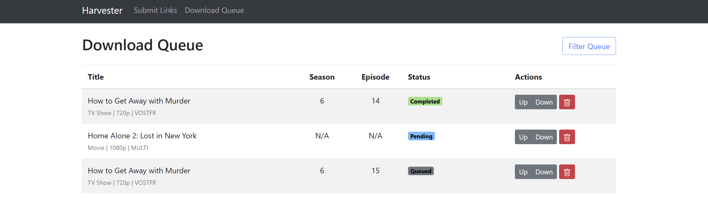

# Harvester

Harvester is a self-hosted download manager for `1fichier.com`, designed for seamless, unattended operation. It features a modern web interface, a powerful Telegram bot for link submission, and a resilient download queue that automatically handles wait times and retries.  
It also incorporates a dynamic search function that automatically discovers the active `zone-telechargement` domain, intelligently querying the site to retrieve the optimal file based on a user's request.

 

## Key Features

-   **Web UI**: A clean, responsive web interface to submit links and manage the download queue.
-   **Dynamic Download Queue**: View real-time status, progress, and metadata for all files. Interactively reorder the queue priority, delete items, and monitor activity.
-   **Advanced Telegram Bot**: 
    - Add downloads by sending `1fichier.com` links.
    - Search for movies and TV shows with the powerful `/search` command.
    - The bot intelligently parses natural language queries for titles, seasons, and episodes.
-   **Automated Download Handling**: Harvester uses a Selenium backend to intelligently navigate `1fichier.com`, automatically waiting for timers to expire before starting the download.
-   **Resilient & Persistent**: The application uses an SQLite database to maintain the queue's state. It automatically resumes any in-progress downloads on restart and retries failed downloads once.
-   **Consistent Console Logging**: See detailed, color-coded, and emoji-rich logs for all application components, including a live `tqdm` progress bar for active downloads.
-   **Completion Notifications**: Receive a notification via Telegram as soon as a file has finished downloading.
-   **Containerized**: The entire application is containerized with Docker for a simple, one-command setup and consistent deployment.
-   **Secure Authentication**: The web UI is protected by a secure login system that authenticates against an LDAPS server.
-   **Intelligent Search**: Utilizes advanced fuzzy matching (`fuzz.WRatio`) and title parsing (`guessit`) to deliver highly accurate search results, distinguishing between similar titles and ignoring extraneous metadata.
-   **Dynamic URL Fetching**: Automatically finds the latest `zone-telechargement` domain by parsing the official Telegram channel, ensuring the search functionality is always online.
-   **Enhanced Telegram Messages**: Search results are delivered with clickable titles that link to the source page and clean, emoji-rich download links for a better user experience.

## Setup & Installation

### 1. Configuration (`.env` file)

Before running the application, you need to provide your Telegram and LDAP credentials.

1.  **Create a Telegram Bot**:
    -   Talk to the [@BotFather](https://t.me/BotFather) on Telegram.
    -   Create a new bot to get your **Bot Token**.
    -   Create a new app at [my.telegram.org](https://my.telegram.org) to get your **API ID** and **API Hash**.

2.  **Get your Chat ID**:
    -   Create a new private group on Telegram and add your bot to it.
    -   Send a message to the group.
    -   Forward that message to the [@userinfobot](https://t.me/userinfobot) to get the group's **Chat ID** (it will be a negative number, like `-100123456789`).

3.  **Create the `.env` file**:
    In the root of the project directory, create a file named `.env` and add your credentials to it. **This file is ignored by git, so your secrets are safe.**

    ```env
    # Telegram API Credentials
    TELEGRAM_API_ID=1234567
    TELEGRAM_API_HASH=your_api_hash_here
    TELEGRAM_BOT_TOKEN=your_bot_token_here
    TELEGRAM_GROUP_CHAT_ID=-100123456789

    # LDAP Configuration
    LDAP_SERVER=ldaps://your-ldap-server.com
    LDAP_PORT=636
    LDAP_BASE_DN=ou=users,dc=example,dc=com
    LDAP_USER_DN=uid={username},ou=users,dc=example,dc=com

    # Optional: Specify a filename for the log file
    LOG_FILENAME=harvester.log
    ```

### 2. Create a Telegram Session

The application needs a `.session` file to connect to your Telegram account and monitor the channel for new links.

1.  **Run the Setup Script**:
    ```sh
    python setup.py
    ```

2.  **Follow the Prompts**:
    The script will prompt you for your phone number, the code you receive from Telegram, and your two-factor authentication password if you have one enabled.

    This will create a `telegram_session.session` file in the root of the project. **This file is ignored by git, so your session is safe.**

### 3. Running with Docker (Recommended)

1.  **Build the Docker Image**:
    ```sh
    docker build -t harvester .
    ```

2.  **Run the Docker Container**:
    This command will start the server, map the necessary ports and volumes, and ensure it restarts automatically.

    ```sh
    docker run -d \
      -p 5000:5000 \
      -v ./downloads:/app/downloads \
      -v ./database.db:/app/database.db \
      -v ./telegram_session.session:/app/telegram_session.session \
      --env-file .env \
      --name harvester-app \
      --restart=unless-stopped \
      harvester
    ```
    -   `-d`: Run the container in detached mode.
    -   `-p 5000:5000`: Maps the container's port 5000 to your host's port 5000.
    -   `-v ./downloads:/app/downloads`: Mounts a local `downloads` folder to store completed files.
    -   `-v ./database.db:/app/database.db`: Mounts the SQLite database file locally for persistence.
    -   `-v ./telegram_session.session:/app/telegram_session.session`: Mounts the Telegram session file.
    -   `--env-file .env`: Loads the environment variables from your `.env` file.
    -   `--name harvester-app`: Assigns a convenient name to the container.
    -   `--restart=unless-stopped`: Ensures the container automatically restarts on boot or if it crashes.

### 4. Running Locally (Without Docker)

1.  **Create a Virtual Environment**:
    ```sh
    python -m venv venv
    source venv/bin/activate  # On Windows, use `venv\Scripts\activate`
    ```

2.  **Install Dependencies**:
    ```sh
    pip install -r requirements.txt
    ```

3.  **Run the Application**:
    ```sh
    python app.py
    ```

## Usage

1.  **Access the Web UI**:
    Open your web browser and navigate to `http://localhost:5000`. You will be prompted to log in with your LDAP credentials. From here, you can submit links and view the download queue.

2.  **Use the Telegram Bot**:
    - **Adding Links**: Simply send a message containing one or more `1fichier.com` links to the Telegram group you created. The bot will process them and add them to the queue.
    - **Searching for Media**: Use the `/search` command to find movies or specific TV show episodes. The parser is flexible and can handle various formats. For example:
      ```
      /search Mr Robot season 3 episode 2
      /search Mr Robot episode 2 season 3
      /search Mr Robot saison 3
      /search The Matrix
      ```

3.  **View Logs**:
    If running with Docker, you can see the live logs and the download progress bar by tailing the container's logs:
    ```sh
    docker logs -f harvester-app
    ```
    If running locally, the logs will appear directly in your console.

---

<p align="center">
  Vibe-coded with ❤️ by Google Gemini - CLI
</p>